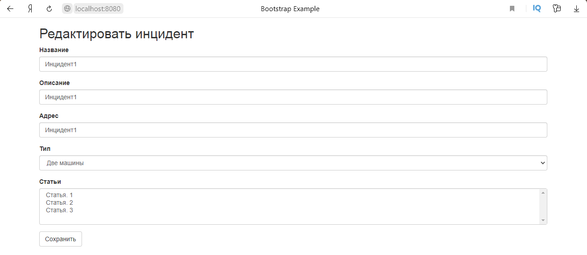
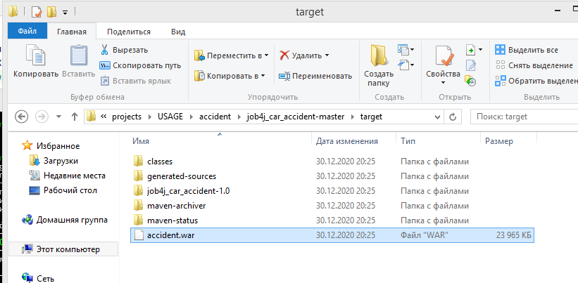
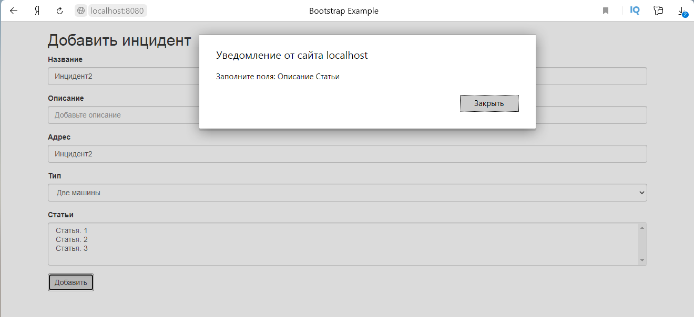

# Проект - Автонарушители

# Содержание
* [Использованные технологии](#Использованные-технологии)
* [О проекте](#О-проекте)
* [Сборка](#Сборка)
* [Использование](#Использование)
* [Контакты](#Контакты)
## Использованные технологии
* Spring MVC
* Spring core (DI, IoC)
* Spring JDBC
* Spring Hibernate
* Spring Data JPA
* Spring Security
* Apache Commons DBCP (Database Connection Pooling)
* SLF4J и Log4j
* PostgreSQL
* Collections Framework
* JS, JQuery
* HTML, CSS, Bootstrap
* JSP
* JSTL
* Travis CI
## О проекте
* Данное веб-приложение представляет собой систему учёта автонарушений:  
  
* При добавлении нового инцидента нужно указать название, описание, адрес, выбрать тип инцидента 
(возможно выбрать только 1 тип) и статьи (возможно выбрать несколько):  
  
  
* Возможно также редактировать уже существующие инциденты:  
  
* Список доступных статей и типов можно поменять (см. раздел "[Сборка](#Сборка)")  
* Неавторизованные пользователи с приложением работать не могут  
* Регистрация основана на контроллере RegControl, который инициирует сохранение новых пользователей в БД. 
Форма регистрации:  
  
* Авторизация построена на Spring Security. Все зарегистрированные пользователи хранятся в БД. 
Все пароли пользователей хранятся в БД в закодированном виде. Форма авторизации:  
  
  
  
* По умолчанию в БД хранится пользователь с ролью администратора. Его логин - root, пароль - secret  
* Все формы приложения провалидированы с помощью JS и JQuery:  
  
  
  
* Конфигурация всех технологий проекта произведена с помощью Java-классов вместо xml-конфигурации  
* Проект построен на трёх слоях: слой по работе с БД, слой контроллеров и слой сервисов  
* Для работы с БД по умолчанию используется Spring Data JPA. Есть также возможность заменить данную реализацию 
на Spring JDBC, Spring HibernateTemplate или же хранить все данные в памяти  
* Слой контроллеров использует Spring MVC  
* Слой сервисов содержит логику приложения  
* В качестве БД используется PostgreSQL  
* Пул соединений к БД основан на Apache Commons DBCP  
* Проект построен по шаблону MVC. Все виды открываются через GET-методы контроллеров, 
что позволяет передавать на виды необходимые данные  
* Для логирования используется связка slf4j и log4j  
* В качестве видов используются JSP-страницы, реализованные с помощью HTML и Bootstrap  
* Для реализации логики отображения на видах используется JSTL.
## Сборка
1. Установить JDK 14.
2. Скачать Maven.
3. Создать переменные окружения JAVA_HOME и M2_HOME и прописать в переменную окружения Path 
пути до бинарных файлов для JDK и для Maven:  
  
4. Установить сервер БД PostgreSQL. При установке задать: 
    * имя пользователя - postgres 
    * пароль - root
    * порт - 5432 
Также при установке сервера БД PostgreSQL нужно установить программу pg_Admin.

5. Скачать и установить Tomcat.
6. Скачать исходный код проекта с GitHub.
7. Перейти в корень проекта, где лежит файл pom.xml:  
  
  
8. С помощью Maven осуществить сборку проекта:  
  
При успешной сборке должна появиться папка target, в которой располагается war-архив:  
  
  
  
9. Переименовать war-архив:  
  
10. Запустить сервер БД, указав путь до папки data:  
  
11. Запустить программу pg_Admin, установленную вместе с сервером БД PostgreSQL:  
  
12. Создать БД с названием auto_crash:  
  
13. Открыть Query Tool для созданной БД и запустить SQL-скрипты schema.sql и security.schema.reg.sql,
находящиеся в папке db (данная папка находится в корне скачанного проекта):  
  
  
  
Если нужно задать другие списки типов и статей для инцидентов, то нужно сделать это до запуска SQL-скрипта schema.sql 
в следующих строчках скрипта:  
  
14. Задеплоить собранный war-архив в папку webapps, находящуюся в корневой папке скачанного Tomcat:  
  
Сборка завершена. Теперь можно проверить работу приложения.
## Использование
Запускаем Tomcat:  
  
  
Переходим на главную страницу приложения 
[http://localhost:8080/accident/](http://localhost:8080/accident/):   
  
Как видно, мы были переведены на форму авторизации, что означает, что с приложением могут работать только авторизованные 
пользователи. По умолчанию в БД уже хранится один пользователь с ролью администратора. Поэтому мы можем войти через 
администратора (логин - root, пароль - secret):  
  
  
Теперь осуществим выход и зарегистрируем нового пользователя:  
  
  
Авторизуемся под только что созданным пользователем при этом введём некорректный пароль:  
  
  
Как видно, мы получили предупреждение.
Теперь введём корректные данные:  
  
  
Добавим новый инцидент:  
  
  
Отредактируем добавленный инцидент:  
  
  
  
Проверим валидацию. Для этого нажмём на кнопки отправки форм, при этом не заполнив все поля форм:  
  
  
  
## Контакты
Почта: studentnstu97@mail.ru 
Skype: live:.cid.9cdc925fb48220b4